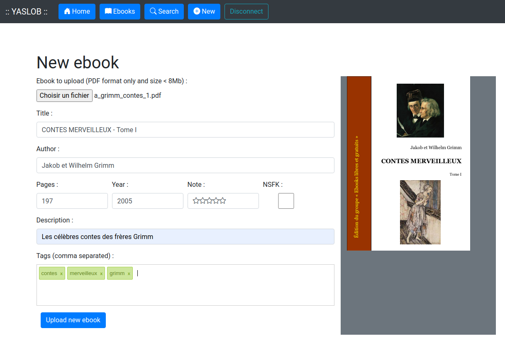

# yaslob
Yet Another Simple Library Of eBooks

## Context
I was searching a tool to handle my ebooks stored on small server (Netgear Stora in my case). [Calibre](https://calibre-ebook.com/) is a very powerful but too complex and needs a lots of RAM and CPU. [Cops](https://github.com/seblucas/cops) fulfills my needs but still needs a Calibre installation.


## Goals
So **YASLOB** : Yet Another Simple Library Of eBooks
Constraints :
  * [X] can be installed on a small server (PHP 5.1.6)
  * [X] does not need lots of dependencies on server side (cannot install anything, because of low space left)
  * [X] doesn't need a database, only an XML file for storing data
  * [X] doesn't need json_encode() and json_decode() functions (PHP 5.1.6)
  * [X] looks professional and responsive design 
  * [X] can be configured easilly (simple file)
  * [X] follows MVC architecture 

Requirements : 
  * [X] upload a new ebook (in PDF format only)
  * [X] gets automatically : cover image, title, author, year, number of pages
  * [X] add a description, a note by clicking on stars
  * [X] add/remove tags easily (with autocomplete)
  * [X] list ebooks by date (last 10 added ebooks for example)
  * [X] search ebooks by tags and by word in title, author or description
  * [X] modify or delete an uploaded ebook
  * [X] protect add/edit/delete actions with authentication 
  * [ ] hide access to some ebooks (Not Safe For Kids)


## Screenshots
| Add an ebook                 |  List ebooks                    |
:-----------------------------:|:--------------------------------:
 | 


## Installation
1 - Download all files on your webserver.

2 - The **data** folder must be writable by your server. For example :
```
chown -R www-data:www-data data
chmod 755 data/db/ebooks.xml
```
And depending on the security level you want to reach, **data** folder should be placed outside the root folder of the webserver.

3 - Modify **BASE_URL** parameter in ```config.php```. For example :
```php
// Base URL
define("BASE_URL", "http://1.2.3.4/yaslob");
```
4 - Change the admin credentials too
```php
// Base URL
define("ADMIN_LOGIN", "admin");
define("ADMIN_PASSWORD", "p4ssw0rd");
```

## Database
Data format in XML file :
```xml
<?xml version="1.0" encoding="UTF-8"?>
<ebooks>
  <ebook>
    <title>CONTES MERVEILLEUX - Tome I</title>
    <author>Jakob et Wilhelm Grimm</author>
    <description>Premier tome des célèbres contes des frères Grimm</description>
    <year>2005</year>
    <pages>197</pages>
    <date>2021-04-16 09:21:09</date>
    <url>contes-merveilleux-tome-i</url>
    <nsfk>false</nsfk>
    <note>0</note>
    <tags>
      <tag>contes</tag>
      <tag>merveilleux</tag>
    </tags>
  </ebook>
</ebooks>
```

## Credits
External libraries used (thank you) :
  * [Bootstrap](https://getbootstrap.com/)
  * [jQuery](https://jquery.com/)
  * [PDF.js](https://mozilla.github.io/pdf.js/)
  * [jQuery Tags Input](http://xoxco.com/projects/code/tagsinput/)

